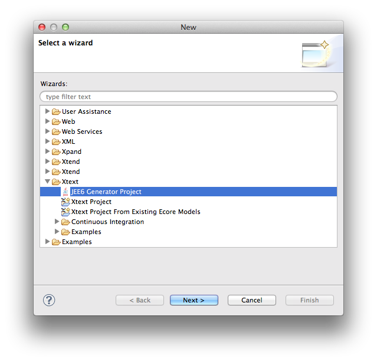

# Die JEE-Generatoren

Die JEE-Generatoren sind in der Lage, eine komplette JEE6- oder
JEE7-Web-Applikation aus einem einfachen Modell zu generieren.  Das
Framework wurde mit Xtext realisiert und die beiden Generatoren sind als
Eclipse-Plugin verfügbar.

## JEE-Projekt anlegen {#new-project}

Ein neues JEE-Projekt kann mit der JEE-Distribution einfach angelegt werden.
Dazu muss der Menüpunkt _File -> New -> Project..._  aufgerufen werden.  Im
sich öffnenden Dialog wählt man unter dem Punkt Xtext den Punkt JEE6
Generator Project aus:



Danach wählt man einen Projektnamen aus: 


Es wird danach ein Projekt namens "beispiel" angelegt. In diesem Projekt
sind alle zum Bau notwendigen Dateien enthalten.  Die JEE-Distribution
enthält auch schon die JBoss-Tools, mit denen die JBoss-Laufzeitumgebung
definiert werden kann.  Diese Laufzeitumgebung muss als Library in den Build
Path mit aufgenommen werden.  Will man das Modell später mit ant bauen,
empfiehlt sich das Anpassen der Datei _$HOME/.jee6.properties_.  Hier muss
eingetragen werden, wo sich die JEE6-Distribution und der benutzte
Application Server befindet.  Die Variablen lauten:

 * eclipse.home
 * jboss.home
 * glassfish.home

Dies muss nur ein einziges Mal für alle JEE-Projekte durchgeführt werden. 
Die letzten beiden Anmerkungen können in den Dateien
_$PROJECT_HOME/LiesMich.txt_ bzw.  _$PROJECT_HOME/ReadMe.txt_ nachgelesen
werden.

## Im JEE-Projekt entwickeln {#entwickeln}

Die Datei _$PROJECT_HOME/model/beispiel.jee6_ ist das Modell für unsere
Web-Anwendung.  Hier sollte die erste Befehlszeile den eigenen Bedürfnissen
angepasst werden.  Aus der Befehlszeile

```mydsl
application "beispiel" context "/beispiel" package org.example.jee6.beispiel development strict;
...
```
kann z.B. die Package-Definition und der Klartextname der Applikation angepasst werden. 

```mydsl
application "beispiel" context "/beispiel" package org.example.jee6.beispiel development strict;
...
```

Danach kann durch Aufrufen der ant-Targets _generate_ und _package_ die
Applikation generiert und die WAR-Datei gebaut werden.  Diese kann mit _ant
deploy_ in den passenden Application Server per Hot Deployment installiert
werden.  Der Generatorlauf erzeugt dabei folgende Artefakte:

XHTML Presentation Layer inkl. Logos und CSS

 * Action Handler
 * DAO
 * Entity Beans
 * Resource Bundles für I18N und L10N
 * Eine version.properties für die Versionsnummer.
 * Dateien für Metadaten:
     * _web.xml_
     * _faces-config.xml_
     * _jboss-web.xml_

Die Dateien für den XHTML-Presentation Layer werden nur generiert, wenn die
dazu benötigte Dateien noch nicht vorhanden sind.  Bestehende Dateien werden
durch den Generator nicht überschrieben.  Die Action Handler und DAOs werden
gemäß dem sog.  Generation Gap Pattern generiert.  Die abstrakten
Basisklassen werden bei jedem Generatorlauf neu generiert, während die
konkreten Klassen für die Implementierung der Business Logik nur einmal bei
Fehlen generiert werden.  In der abstrakten Basisklasse der DAOs werden z.B. 
die konfigurierten Persistenzkontexte untergebracht.  Die generierten
Dateien werden in folgende Verzeichnisse hinterlegt:

 * _src_
   In diesem Verzeichnis werden die konkreten Klassen für die Action Handler und DAOs hinterlegt. Ferner werden hier die Resource Bundles und einige Service Klassen hineingeneriert. In diesem Verzeichnis können auch weitere eigene Klassen untergebracht werden. Alles, was hier hineingeneriert wird, wird nicht wieder überschrieben sondern nur angelegt, wenn die Klasse fehlt.
 * _src-gen_
   Hier werden die abstrakten Klassen und Entity Beans untergebracht. Diese werden bei jedem JEE-Generatorlauf neu generiert.
 * _res_
   In diesem Verzeichnis werden bei Projektanlage Bilder und Libraries (JARs) angelegt. Hier können weitere Bilder untergebracht werden. Der JEE-Generator generiert in diesem Verzeichnis nichts.
 * _res-gen_
   In diesem Verzeichnis werden die Deployment Deskriptoren generiert. Diese Dateien werden bei jedem JEE-Generatorlauf neu generiert.
 * _WebContent_
   Hier werden die XHTML-Dateien und das CSS hineingelegt. Wie im src-Verzeichnis werden hier nur fehlende Dateien angelegt und bestehende nicht überschrieben.

**Hinweis!** Die Inhalte der Verzeichnisse _src_, _res_ und _WebContent_ sollten der
Verseinsverwaltung der Wahl zugeführt werden, da dort auch eigene
Implementierungen untergebracht sein können.  Die Inhalte der Verzeichnisse
_src-gen_ und _res-gen_ sollten nicht einer Versionsverwaltung zugeführt werden,
da sie bei jedem JEE-Generatorlauf neu generiert werden.

## Allgemeine Modelleinstellungen {#modelleinstellungen}
In der Modelldatei wird als erstes Kommando die Applikation beschrieben. Die Syntax lautet:

```mydsl
application <Name> context <Context-Path> package <Package-Id> (timeout <Timeout-Minutes>) (<Project-State>) (strict);
```

Der Name ist ein String, der im Klartext die Applikation beschreibt. Der
Context-Path ist ein String, der den Applikationskontext festlegt.  Dieser
muss zwingend mit einem Schrägstrich "/" beginnen.  Es ist der erste Teil
der URI.

Optional kann der Session Timeout in Minuten festgelegt werden. Wird dieser
nicht definiert, wird der Default des Application Servers verwendet. 
Üblicherweise beträgt dieser Wert 30 Minuten.  Als project-state können die
drei Schlüsselwörter **development**, **integration** und **productive**
dienen und beschreiben den Zustand des Projektes.  Abhängig davon wird z.B. 
das Logging entsprechend verschärft.

| 											|Datei 													|development 	|integration 	|productive	|
|---|---|---|---|---|
|Logging Level 								|**src-gen/&lt;package&gt;/log4j.properties** 			|DEBUG 			|DEBUG 			|INFO		|
|Property hibernate.show_sql 				|**res-gen/WEB-INF/classes/META-INF/persistence.xml** 	|true 			|false 			|false		|
|Property eclipselink.logging.level 		|**res-gen/WEB-INF/classes/META-INF/persistence.xml** 	|DEBUG 			|INFO 			|INFO		|
|<context-param> javax.faces.PROJECT_STAGE 	|**res-gen/WEB-INF/web.xml** 							|Development 	|SystemTest 	|Productive	|

Als letztes optionales Schlüsselwort dient **strict**. Es entscheidet, ob in den Basisklassen der Action Handler die Standardmethoden abstrakt vordefiniert werden und somit in den konkreten Klassen vorhanden sein müssen. Dadurch wird einerseits der Code besser, allerdings kann es vorkommen, dass die geforderten Methoden tatsächlich nicht gebraucht werden. Das kann aber nur bei starker Anpassung der XHTML-Masken passieren.

Nach dem **application**-Kommando werden Optionen festgelegt, die das Verhalten der Web-Applikation näher beschreiben. Danach folgen die Beschreibungen der Entity Beans, welche auf einer [eigenen Seite genauer beschrieben](.#entitybeans) werden und zuletzt die Aufgaben- bzw. Prozess-Umgebungen, in denen die Entity Beans benutzt werden sollen.


### Applikationsoptionen {#appoptionen}

Die Applikationsoptionen beschreiben die Web Applikation näher. Sie beeinflussen folgende Eigenschaften:

 1. Persistenz Kontexte
 2. Verwendete Sprachen (Lokalisierung)
 3. Mail
 4. Security Domains
 5. Parameter

#### Persistenz Kontexte

Der JEE-Generator unterstützt mehrere Persistenz Kontexte in einer
Applikation.  Das setzt voraus, dass in diesem Falle die Datasources als
XA-Datasource im Application Server konfiguriert sind.  Die Syntax lautet:

```mydsl
persistence unit <Unit-Name> jndi <Jndi-Name> (cacheable) (MySQL|DB2|Oracle);
```

Der unit-name wird in der _persistence.xml_ als Referenz innerhalb der Web
Applikation verwendet.  Der JNDI-Name definiert, wie die Datasource im
Application Server wiederzufinden ist.  Eine eingehende Beschreibung, wie
der JDNI-Name lauten sollte, findet sich auf diesen Seiten.  Wird das
optionale Schlüsselwort **cacheable** verwendet, wird die Persistence Unit als
Second Level Cache konfiguriert.

**Hinweis!** Es reicht nicht, nur das **cacheable** Schlüsselwort zu setzen, um im
Application Server Second Level Caching zu aktivieren.  Es müssen meistens
noch am Application Server selbst noch Konfigurationen vorgenommen werden.

Es werden die Datenbanken

 * MySQL (Default)
 * DB2
 * Oracle

unterstützt. Die Angabe wird nötig, um in der generierten Datei
_persistence.xml_ den SQL-Sprachdialekt festzulegen.

#### Verwendete Sprachen (Lokalisierung)

In mehrsprachigen Umgebungen ist die Lokalisierung der Applikation immer
wünschenswert.  Der JEE-Generator hat für alle Komponenten eine
entsprechende Unterstützung parat.  Die Auswahl der Sprache selbst wird
typischerweise im Browser eingestellt.  Die Web Applikation erfährt das
dadurch, dass die im Browser eingestellte Sprache im Request mitgeschickt
wird.  Die Lokalisierung wird über sog.  Resource Bundles vorgenommen. 
Diese werden in den XHTML-Seiten eingebunden.  Für jedes Attribut, Entity
Bean, etc.  werden die dafür benötigten Einträge in die Resource Bundles
nachgetragen, sofern sie noch nicht enthalten sind.  Bereits bestehende
Einträge werden nicht verändert.  An dieser Stelle wird beschrieben, wie in
der Modelldatei konfiguriert wird, welche Sprachen unterstützt werden
sollen.  Die Syntax lautet:

```mydsl
locale <Language> (<Country>) (default);
```

Die **language** ist der ISO-Code der zu verwendenden Sprache und hat
typischerweise kleine Buchstaben.  Der optionale Wert **country** bestimmt
die ISO-Länderkennung typischerweise in Großbuchstaben.  Dadurch werden
landestypische Sprachvarianten unterschieden.

**Hinweis!** Es muss mindestens eine Locale-Definition vorhanden sein und genau eine
braucht das ansonsten optionale Schlüsselwort **default**.  Diese Sprache wird
verwendet, falls die im Browser eingestellte Sprache in den Resource Bundles
nicht gefunden werden konnte.

#### E-Mail

Will die Web Applikation E-Mail verschicken, muss einerseits der
Mail-Versand im Application Server konfiguriert sein, und andererseits hier
im Model eingetragen werden, unter welchem JDNI-Namen der Mailservice
erreichbar ist.  Dazu dient die einfache Syntax:

```mydsl
smtp <Jndi-Name>;
```

Die in den genötigten XML-Deskriptoren werden vom JEE-Generator automatisch
erzeugt.  Die Resource muss manuell in dem DAO eingetragen werden, in dem
Mailing verwendet werden soll.  Das dazugehörige Code-Schnipsel sieht
folgendermaßen aus:

```java
@Resource(name="<jndi-name>")
private javax.mail.Session mailSession;
```

Wird für jndi-name "mail/Default" verwendet, muss im JBoss Application
Server nichts mehr konfiguriert werden.

#### Security Domain

Sollen nur bestimmte User für bestimmte Bereiche (in der
JEE-Generator-Nomenklatur "Prozesse") Zugang haben, so muss eine sog. 
Security Domain über einen JNDI-Namen referenziert werden.  Dieser muss
dementsprechen wie die E-Mail im Application Server konfiguriert sein und
benutzt den JAAS-Standard.  Die Syntax lautet:

```mydsl
security domain <Jndi-Name> (clustered);
```

Das optionale Schlüsselwort **clustered** bestimt, ob die Security Domain in
einer geclusterten Umgebung funktionsfähig sein muss.

#### Web Parameter
 
Mit Web-Parametern kann man der Web Applikation in der __web.xml__ Parameter übergeben. Die Syntax lautet:

```mydsl
param <Key> = <Value> (description <Description>);
```

Die Einträge können beliebig häufig im Modell eingetragen werden. Aus folgender Modellzeile:

```mydsl
param de.itemis.purchasing.ITEMIKER = "itemis" description "LDAP-Gruppe aller itemiker";
```

wird in der _web.xml_:

```html
<context-param>
    <description>LDAP-Gruppe aller itemiker</description>
    <param-name>de.itemis.purchasing.ITEMIKER</param-name>
    <param-value>itemis</param-value>
</context-param>
```

Mit der Methode String getInitParameter(final String key) in einem Action
Handler kann auf diesen Wert zugegriffen werden.  Die Werte sind aus Sicht
des Application Servers und der Applikation selbst nicht veränderlich.

## Entity Beans {#entitybeans}
 In der Modelldatei können Entity Beans über die Schlüsselwörter **entity** und **options** definiert werden. Options sind spezielle Entity Beans, mit denen man Auswahllisten definieren kann. Die Auswahllisten können entweder editierbar sein, oder als Enumeration festgelegt werden.

Eine einfache Entity Bean wird mit dem Schlüsselwort **entity** eingeleitet. In ihr können beliebig viele Attribute benutzt werden. Es können Text- und EMail-Felder als ID-Felder definiert werden. Wird kein ID-Feld definiert, wird automatisch ein Integer-Attribut mit Namen id generiert. Eine einfache Definition sieht folgendermaßen aus:

```mydsl
entity Address
{
    Text street;
    Text plz;
    Text location;
}
```
Nach einem Generatorlauf kann die Applikation deployed werden. Die Maske sieht dann wie folgt aus: 


Will man noch den Adresstyp zwischen privat und geschäftlich angeben, kann
eine nicht editierbare option benutzt werden.  Diese **option** wird als
Enumeration generiert.  Als Werte können nur Textschlüssel verwendet werden. 
Diese Schlüssel werden automatisch im Resource Bundle aller definierter
Sprachen angelegt, falls sie noch nicht vorhanden sind.  In der Address
Entity Bean wird der Adresstyp AddressOption als Attributtyp **Option**
eingebunden.  In der Datenbank entsteht dadurch eine 1:1-Relation.

```mydsl
options AddressOption
{
    "address.work",
    "address.home"
}
entity Address
{
    Text street;
    Text plz;
    Text location;
    Option AddressOption addressOption;
}
```

In der Maske wird dadurch eine Combobox generiert. Passt man noch die
Resource Bundles unter $PROJECT_HOME/src/<package>/messages.properties an,
sieht dann die Maske folgendermaßen aus:


Die Generierung einer Combobox erfordert noch weitere Dinge im Hintergrund:

 1. Für die Combobox muss ein Value Converter für JSF generiert werden, der die Werte aus der XHTML-Maske in Entity Bean-IDs konvertiert.
 2. Die Entity Beans müssen die Methoden **equals()** und **hash()** so überschreiben, dass Entity Beans mit denselben IDs als identisch angesehen werden, sonst funktioniert der Value Converter nicht.
 
Es macht natürlich Sinn, dass es Personen gibt, in denen mehrere Adressen
gespeichert werden.  Damit wird das Modell um die Entity Bean **Person**
ergänzt:

```mydsl
entity Person
{
    Text id login;
    Text name;
    Entity Address [] addresses;
}
```

In dieser Entity Bean wird ein Textfeld als ID-Feld markiert. Dadurch gibt
es kein automatisches Integer-ID-Feld mehr.  Es darf nur ein Feld als
ID-Feld innerhalb einer Entity Bean gesetzt werden.  Ferner wird mit dem
Schlüsselwort Entity eine 1:n-Relation eingeführt, um mehrere Adressen an
die Entity Bean binden zu können.  Dabei muss der Typ - in diesem Falle
Address - mit den []-Zeichen markiert werden, sonst wäre die Relation nur
1:1.  Die Maske für die Person Entity Bean sieht folgendermaßen aus:


Klickt man auf den "Edit addresses"-Button, gelangt man in die schon
bekannte Maske der **Address** Entity Bean.

### Weitere Attributtypen

Um Daten in einer Datenbank zu speichern, machen diverse Datentypen Sinn.
Jedes Attribut besteht aus der Kombination Datentyp, ergänzende Optionen
Attributname und Transient-Flag.  Wird ein Attribut abschließend mit dem
transient-Schlüsselwort markiert, so wird dieses Attribut nicht in der
Datenbank gespeichert.  In diesem Fall werden zwei Klassen für die Entity
Bean gemäß den Generation Gap Pattern generiert.  Eine abstrakte Basisklasse
enthält die Attribute der Entity Bean, die konkrete Klasse enthält Getter-
und Setter-Methoden für die transienten Attribute.  Man kann die transienten
Methoden dazu verwenden, um aus anderen Attributen Werte zusammen zu bauen. 
Aus Vor- und Nachnamen kann man den gesamten Namen als transientes Attribut
herleiten.

```mydsl
entity Person
{
    Text id login;
    Text forename;
    Text surename;
    Text name transient;
    Entity Address [] addresses;
}
```

Daraus wird in der Datei $PROJECT_HOME/src/<package>/entites/Person.java:

```java
/*
* Generated by Xtext/JEE6 Generator.
* Copyright (C) 2013 itemis AG
* $Id$
*/
package de.itemis.jee6.beispiel.entities;
import javax.persistence.*;
/**
* This class implements the Person entity bean,
*/
@Entity
@Inheritance(strategy = InheritanceType.SINGLE_TABLE)
@Table(name = "Person")
public class Person extends AbstractPerson {
    private static final long serialVersionUID = 1L;
    /**
    * This method is a transient getter of the virtual property name.
    *
    * @return The computed value for property name.
    */
    @Transient
    @Override
    public String getName()
    {
    	return getSurename() + ", " + getForename();
    }
}
```

Aus Gründen der Übersichtlichkeit wurde auf Prüfen von Null-Pointern verzichtet. Im Folgenden werden die Attribute aufgelistet und erklärt.

#### Text

Das Textattribut wurde schon ausführlich erklärt. Es hat die Syntax:

```mydsl
Text (id) <Name> (transient);
```

In einer XHTML-Seite wird aus der Modellzeile

```mydsl
Text subject;
```

im Formular folgendes Schnipsel generiert:

```html
<tr>
    <td class="mid">
        <h:outputLabel for="subject" value="#{msg['info.startup.subject']}"/>
    </td>
    <td>
        <h:inputText id="subject" label="#{msg['info.startup.subject']}" maxlength="255" value="#{infoHandler.startup.subject}"/>
    </td>
</tr>
```

#### Integer

Integer-Datentypen werden durch das Schlüsselwort Int gefolgt von einem Variablennamen eingeleitet. Im XHTML-Formular wird dabei automatisch ein entsprechender Value Converter generiert, der den Inhalt des Eingabefeldes automatisch in einen Integer umwandelt. Die Syntax lautet:

```mydsl
Int <Name> (transient);
```

Aus der Modellzeile

```mydsl
Int integerEntry;
```

wird folgendes Schnipsel im XHTML generiert:

```html
<tr>
    <td class="mid">
        <h:outputLabel for="integerEntry" value="#{msg['info.startup.integerentry']}"/>
    </td>
    <td>
        <h:inputText id="integerEntry" label="#{msg['info.startup.integerentry']}" size="10" value="#{infoHandler.startup.integerEntry}"/>
    </td>
</tr>
```

#### Number

Number-Datentypen werden durch das Schlüsselwort Number gefolgt von einem Variablennamen eingeleitet. Java-seitig wird dafür ein double generiert Im XHTML-Formular wird dabei automatisch ein entsprechender Value Converter generiert, der den Inhalt des Eingabefeldes automatisch in eine Kommazahl umwandelt. Die Syntax lautet:

```mydsl
Number <Name> (transient);
```

Aus der Modellzeile

```mydsl
Number numberEntry;
```

wird folgendes Schnipsel im XHTML generiert:

```html
<tr>
    <td class="mid">
        <h:outputLabel for="numberEntry" value="#{msg['info.startup.numberentry']}"/>
    </td>
    <td>
        <h:inputText id="numberEntry" label="#{msg['info.startup.numberentry']}" maxlength="10" value="#{infoHandler.startup.numberEntry}"/>
    </td>
</tr>
```

#### E-Mail

Ein E-Mail-Datentyp kann als ID geführt werden und ist im Prinzip ein Textfeld mit dem Unterschied, dass ein Validator die Eingabe auf das Format einer gültigen EMail-Adresse prüft. Die Syntax lautet:

```mydsl
Email (id) <Name> (transient);
```

In einer XHTML-Seite wird aus der Modellzeile

```mydsl
Email mail;
```

im Formular folgendes Schnipsel generiert:

```mydsl
<tr>
    <td class="mid">
        <h:outputLabel for="mail" value="#{msg['info.startup.mail']}"/>
    </td>
    <td>
        <h:inputText id="mail" label="#{msg['info.startup.mail']}" maxlength="255" value="#{infoHandler.startup.mail}">
            <f:validator validatorId="mailValidator"/>
        </h:inputText>
    </td>
</tr>
```

Man beachte, dass automatisch der **mailValidator** eingebunden ist, der
sich in der JEE6-Utils-Bibliothek befindet.

#### Clob

Alle Textfelder werden in der Datenbank als Varchar angelegt, welche eine
Längenbegrenzung auf 255 Zeichen beinhaltet.  Wenn man mehr braucht, muss
ein sog.  Character Large Object benutzt werden.  Im XHTML-Formular wird
daraus eine Textarea generiert.  Java-seitig ist dieser Datentyp wie Text
und E-Mail ein java.lang.String.  Die Syntax lautet:

```mydsl
Clob <Name> (transient);
```

In einer XHTML-Seite wird aus der Modellzeile

```mydsl
Clob clobEntry;
```

im Formular folgendes Schnipsel generiert:

```mydsl
<tr>
    <td class="top">
        <h:outputLabel for="clobEntry" value="#{msg['info.startup.clobentry']}"/>
    </td>
    <td>
        <h:inputTextarea cols="32" id="clobEntry" label="#{msg['info.startup.clobentry']}" rows="7" value="#{infoHandler.startup.clobEntry}"/>
    </td>
</tr>
```

#### Blob

Will man Binärdaten in der Datenbank speichern, muss man den Datentyp Blob
verwenden, der mit dem Schlüsselwort Blob benutzt wird.  Java-seitig wird
daraus ein byte[]-Array.  In einer XHTML-Maske erscheinen Attribute dieses
Typs nicht.  Die Syntax lautet:

```mydsl
Blob <Name> (transient);
```

Hinweis Aus Gründen der Performance sollten nicht zu große Binärdaten in
einer Datenbank gespeichert werden.  Große Datensätze bringt man besser im
Dateisystem unter.

#### Boolean

Einen einfachen Booleschen Datentypen führt man mit dem Schlüsselwort
Boolean ein.  Sollte der Attrributname active lauten, wird noch weitere
Funktionalität generiert.  In der XHTML-Maske wird in der Liste ein
Kommandolink ergänzt, mit dem der Aktivierungsstatus dieses Attributes
gewechselt werden kann.  Das setzt weitere Methoden im Action Handler und im
DAO voraus, die automatisch mit generiert werden.

```mydsl
<tr>
    <td class="mid">
        <h:outputLabel for="active" value="#{msg['info.startup.active']}"/>
    </td>
    <td>
        <h:selectBooleanCheckbox id="active" label="#{msg['info.startup.active']}" value="#{infoHandler.startup.active}"/>
    </td>
</tr>
```

#### Timestamp

Mit diesem Datentypen kann ein Zeitstempel bestehend aus Uhrzeit und
Kalenderdatum in der Datenbank gespeichert werden.  In der Entity Bean wird
hierfür der Datentyp Date verwendet.  Über die Verwendung von Datumsangaben
über Prepared Statements in EQL wird in diesem Artikel berichtet.  Wird dem
Schlüsselwort Timestamp noch ein auto beigegeben, so wird automatisch beim
erstmaligem Speichern der Entity Bean das Erzeugungsdatum in dieses Attribut
gespeichert.  Benutzt man stattdessen oder zusätzlich noch das Schlüsselwort
update, wird bei jeder Änderung der Entity Bean in der Datenbank dieses
Attribut auf den aktuellen Zeitstempel gebracht.  Die Syntax lautet:

```mydsl
Timestamp (auto) (update) <Name> (transient);
```

Für folgende Modellzeile

```mydsl
Timestamp timestamp1;
```

wird in der XHTML folgendes Schnipsel generiert:

```html
<tr>
    <td class="mid">
        <h:outputLabel for="timestamp1" value="#{msg['info.startup.timestamp1']}"/>
    </td>
    <td>
        <h:inputText id="timestamp1" label="#{msg['info.startup.timestamp1']}" value="#{infoHandler.startup.timestamp1}" maxlength="10" styleClass="date">
            <f:convertDateTime pattern="dd.MM.yyyy" type="date"/>
        </h:inputText>
    </td>
</tr>
```

Wird beim Timestamp das Schlüsselwort auto oder update ergänzt, wird kein
Formulareinstrag im XHTML generiert.  Stattdessen werd in der Entity Bean
entsprechende Methoden ergänzt:

```java
@PrePersist
public void prePersist() {
    if (getCreation() == null) {
        setCreation(new Date());
    }
}
```

Durch den Test auf den Null Pointer kann vor der Persistierung der Entity
Bean schon ein anderes Datum als Erzeugungsdatum angegeben werden.

```java
@PreUpdate
public void preUpdate() {
    setChanged(new Date());
}
```

Die Annotationen **@PrePersist** und **@PreUpdate** sind Bestandteile des JEE-Frameworks.

#### Date

Mit diesem Datentypen kann ein Kalenderdatum in der Datenbank untergebracht
werden.  In der Entity Bean wird hierfür der Datentyp Date verwendet.  Über
die Verwendung von Datumsangaben über Prepared Statements in EQL wird in
diesem Artikel berichtet.  Die Syntax lautet:

```mydsl
Date <Name> (transient);
```

Eine automatische Aktualisierung bei Anlegen und Ändern dieses Attributtyps
wie beim Timestamp existiert bei diesem Attributtypen nicht!  Aus der
Modellzeile

```mydsl
Date dateElement;
```

wird folgendes XHTML-Schnipsel generiert:

```html
<tr>
    <td class="mid">
        <h:outputLabel for="dateElement" value="#{msg['info.startup.dateelement']}"/>
    </td>
    <td>
        <h:inputText id="dateElement" label="#{msg['info.startup.dateelement']}" value="#{infoHandler.startup.dateElement}" maxlength="10" styleClass="date">
            <f:convertDateTime pattern="dd.MM.yyyy" type="date"/>
        </h:inputText>
    </td>
</tr>
```

#### Entity

Mit diesem Attributtyp kann eine Relation auf eine andere Entity Bean
modelliert werden.  Die Syntax lautet:

```mydsl
Entity <Typ> ([]) <Name>;
```

Es wird zwischen einer 1:1- und einer 1:n-Relation unterschieden, indem dem
Entity Typen das Symbol [] beigestellt wird.  Die 1:1-Relation wird in einem
XHTML-Formular nicht dargestellt.  Soll für diesen Fall eine Combobox zur
Auswahl dargestellt werden, muss das Attribut als Option(s.u.) deklariert
werden.  Für eine 1:n-Relation wird ein Button bereitgestellt, in der die
Liste der Entity Beans bearbeitet werden kann.

#### Option

Soll in einer Entity Bean eine 1:1-Relation in einer Combobox ausgewählt
werden können, muss der entsprechende Attributtyp Option lauten.  Die Syntax
ist ähnlich dem Entity-Attributtyp mit dem Unterschied, dass keine
1:n-Relation benutzt werden kann:

```mydsl
Option <Typ> <Name>;
```

Die als Option referenzierte Entity Bean kann sowohl eine Enumeration sein,
als auch als editierbar gekennzeichnet sein.  Im Modell wird aus der Zeile

```mydsl
Option UserInfo owner;
```

Der XHTML-Codeschnipsel:

```xhtml
<tr>
    <td class="mid">
        <h:outputLabel for="owner" value="#{msg['ordering.orderposition.owner']}"/>
    </td>
    <td>
        <h:selectOneMenu converter="#{orderingHandler.userInfoConverter}" id="owner" label="#{msg['ordering.orderposition.owner']}" value="#{orderingHandler.orderPosition.owner}">
            <f:selectItem itemLabel="#{msg.no_selection}" itemValue="[NULL]"/>
            <f:selectItems itemLabel="#{owner.name}" itemValue="#{owner}" value="#{orderingHandler.userInfoList}" var="owner"/>
        </h:selectOneMenu>
    </td>
</tr>
```

Der Action Handler stellt die Liste der möglichen Auswahlelemente bereit. In
diesem Falle muss die Klasse OrderingHandler die Methode **getUserInfoList()**
bereitstellen.  In dem Beispiel darf die 1:1-Relation den Wert null
annehmen.  Soll das nicht möglich sein, muss das **<f:selectItem>**-Tag entfernt
werden.  Zusätzlich werden noch an der Entity Bean die Methoden **hashCode()**
und **equals()** überladen.  Die von den generierten Action Handlern beinhalten
den dazu passenden Value Converter.  In diesem Beispiel stellt die Klasse
OrderingHandler über die Methode **getUserInfoConverter()** den Converter als
innere Klasse UserInfoConverter zur Verfügung.

#### History

Eine History ist eine spezielle Form der 1:n-Relation. Es können Einträge in
diese Liste hinzugefügt werden, allerdings keine gelöscht werden.  Dadurch
kann ein zeitlicher Verlauf zu einer Entity Bean nachgehalten werden.

Achtung! In einer Entity Bean kann nur eine Historie verwendet werden. Auch
in darunterliegenden Entity Beans darf die Historie nicht mehr verwendet
werden.  Besonderheiten der generierten Entity Beans

Die generierten Entity Beans bieten noch einige Eigenschaften, die den
Umgang mit den Entity Beans vereinfachen.  So wird die **toString()**-Methode
überladen, um alle Attribute der Entity Bean auf einfache Weise ausgeben zu
können.  Das ist für Logging-Zwecke besonders sinnvoll.

Sämtliche Attribute und Methoden werden mit Javadoc-Kommentaren dokumentiert.

Wird in keinen Attribut das Schlüsselwort id verwendet, wird automatisch
eine ID-Spalte generiert, die die IDs aus einer ID-Tabelle beziehen.  Diese
Form der ID-Generierung ist die kompatibelste Variante zwischen den
Application Servern und den verwendeten Datenbanken.  Jede Tabelle erhält in
der IDs-Tabelle eine eigene Zeile, in denen die ID-Ranges verwaltet werden.

```java
private int id;
/**
* This getter returns the ID of this entity bean. The ID of this entity bean is automatically
* generated using the {@link TableGenerator} feature of the container.
*
* @return The ID of this entity bean.
*/
@Id
@TableGenerator(name = "StartupIDs", table = "IDs", pkColumnName = "id", valueColumnName = "value", pkColumnValue = "Startup", initialValue = 1, allocationSize = 10)
@GeneratedValue(strategy = GenerationType.TABLE, generator = "StartupIDs")
public int getId() {
    return id;
}
/**
* This setter sets the ID of this entity bean. Generally its only used by the JEE6 container.
*
* @param id The ID to set.
*/
public void setId(final int id) {
    this.id = id;
}
```

Den Entity Beans können durch weitere Schlüsselwörter noch zusätzliche
Eigenschaften hinzugefügt werden.  Zu diesem Zweck empfiehlt sich die
Auflistung der Syntax:

```mydsl
entity <Name> (filterable) (cloneable) { <Attributes>+ } (persistence unit <Persistence-Unit>);
```

Wie die Attribute attributes aussehen müssen wurde ja schon beschrieben.
Werden für Auswahllisten Optionen verwendet, sieht die Syntax leicht
erweitert aus.  Hier lautet die Syntax:

```mydsl
options <Name> (filterable) (cloneable) (editable { <Attributes>+ }) | ( { <Resource-Key>+ }) (persistence unit <Persistence-Unit>);
```

Hier werden im Wesentlichen zwei Varianten unterschieden:

 * Nicht editierbare Enumerations
 * Editierbare Optionen

Die nicht editierbaren Enumerations wurden weiter oben schon beispielhaft
beschrieben.  Um in einer XHTML eine andere Entity Bean als 1:1-Relation in
einer Auswahlbox auswählen zu können, muss die Referenz auf diese Entity
Bean als Option-Attribut benutzt werden.  Sie unterscheiden sich ansonsten
nicht von den üblichen Entity Beans, die mit dem entity-Schlüsselwort
beschrieben werden.

Für alle Varianten gilt, dass man die erzeugte Entity Bean in eine andere
Persistenz Unit hinzufügen kann.  Es ist dabei zu beachten, dass alle
rekursiv enthaltenen Relationen auf andere Entity Beans auch in derselben
Persistenz Unit sein müssen.  Der Eclipse-Editor quittiert das entsprechend
mit einer Fehlermarkirung im Editor udn der Generatorlauf schlägt
dementsprechend fehl.  Lässt man die Definition auf die Persistenz Unit weg,
wird automatisch die erste aufgelistete gewählt.

#### Ergebnislisten filtern

Speziell für die Suche von Entity Beans aus Ergebnislisten kann das
Filterable-Interface benutzt werden.  Dieses Interface erfordert die
Implementierung der Methode **public boolean filter(String pattern, Locale
locale)**.  Wird das Schlüsselwort filterable gesetzt, wird die Entity Bean in
eine abstrakte Klasse und eine konkrete Klasse generiert.  Die konkrete
Klasse muss dann die besagte Methode **filter()** implementieren.  Da Suchen in
Java schneller vonstatten geht, als in der Datenbank, macht das java-seitige
Filtern bei relativ kleinen Datenmengen Sinn.  Bei großen Datenmengen sollte
nach wie vor auf Seiten der Datenbank gefiltert werden.  Ein weiterer
Vorteil der **filter()**-Methode ist, dass auf transienten Attributen gesucht
werden kann.  Um die Möglichkeit zu haben, sprachabhängig zu vergleichen
oder zu suchen, wird der Methode **filter()** die entsprechende Locale
mitgegeben.  Ein Beispiel für eine **filter()**-Implementierung könnte so
aussehen:

```java
@Override
public boolean filter(String pattern, Locale locale)
{
    return getPosition().toLowerCase(locale).contains(pattern.toLowerCase(locale));
}
```

In diesem Beispiel wird abhängig von der übergebenen Locale nach einem
Suchmuster pattern in einer Bestellposition gesucht.  Die Bestellposition
ist ein transientes Attribut.  Bestellposition und Suchmuster werden gemäß
des verwendeten Locales in Kleinbuchstaben umgewandelt.  Die Implementierung
der **filter()**-Methode reicht natürlich nicht aus.  Es muss natürlich über
eine Datenmenge gefiltert werden.  Das geschieht sinnvollerweise in einem
Action Handler.  Dort wird über das DAO eine Datenmenge bezogen, danach
gefiltert und an die übergeordnete XHTML-Seite übergeben.  Eine solche
**getList()**-Methode könnte folgendes Ausssehen haben:

```java
/**
* This method returns a {@link List} of filtered {@link OrderPosition} of the last orders
* done with the selected {@link Distributor}.
*
* @return The {@link List} of filtered {@link OrderPosition} beans of the last orders done.
*/
public List<OrderPosition> lastOrderList()
{
    List<OrderPosition> lastOrderList = dao.getLastOrderList();
    FilteredList<OrderPosition> filtered = new FilteredList<OrderPosition>();
    filtered.addAll(lastOrderList, pattern, getExternalContext().getRequestLocale());
    return filtered;
}
```

Die Klasse FilteredList erweitert die Klasse ArrayList und ist in der
javadoc/-Bibliothek enthalten.  Sie kann nur Elemente aufnehmen, die das
Filterable-Interface implementieren.  Die Klasse überlädt die Methoden **add()**
und **addAll()**, in denen das Filtern stattfindet.  Es werden nur Elemente der
Liste hinzugefügt, die bei Aufruf der Elementmethode **filter()** true
zurückliefern.  Das Locale wird aus dem Request ermittelt und entspricht
damit der im Browser eingestellten Sprache.

#### Entity Beans klonen

Unter Umständen kann es nötig sein, dass eine Entity Bean geklont wird. Ein
Beispiel hierfür ist, wenn Bestellpositionen kopiert werden sollen.  In
diesem Fall muss das Schlüsselwort **clonable** nach dem Namen der Entity Bean
mitgegeben werden.  Dabei wird die Methode **clone()** überladen.  Damit es mit
der Datenbank keine Probleme gibt, wird das ID-Attribut gelöscht, um die
geklonte Entity Bean später neu persistieren zu können.

### Formularkontrolle

Neben der allgemeinen Beschreibung der Web Applikation und die Definition der Entity Beans im Modell gibt es als weiteren großen Block die Definition der Prozesse. Über Prozesse kann definiert werden, für welche Entity Beans Dialogmasken generiert werden sollen und bei Bedarf, welche Rollen darauf Zugriff haben darf. Die Syntax lautet:

```mydsl
process <Process-Name> (roles <Roles>+) { <Properties>* <Entities>+ } ;
```

Der Name eines Prozesses taucht in der URI auf. Die URL ist dann wie folgt aufgebaut: http://<host>/<context>/<process-name>/<entity>.xhtml. Mit dem Schlüsselwort roles kann festgelegt werden, welche Rollen darauf Zugriff haben. Im Prozess können beliebig viele Properties untergebracht werden. Es handelt sich dabei um Werte, die im Application Server konfiguriert werden und per JDNI referenziert werden. Die Auflistung der Entity Beans führt dazu, dass die dafür nötigen XHTML-Dateien generiert werden.

Für jeden Prozess wird ein eigener Action Handler und ein eigenes DAO generiert. Hier werden die benötigten Zugriffsmethoden auf die konfigurierten Entity Beans und evtl. die benötigten Value Converter generiert. Die Ableitungshierarchie ist dreistufig:

 * Action Handler
    1. konkrete Implemenierung mit Namen <Process-name>Handler
    2. abstrakte Klasse mit Namen Abstract<Process-name>Handler
    3.die abstrakte Basisklasse aller Action Handler AbstractHandler
 * DAOs
    1. konkrete Implemenierung mit Namen <Process-name>Handler
    2. abstrakte Klasse mit Namen Abstract<Process-name>Handler
    3. die abstrakte Basisklasse aller Action Handler AbstractHandler

In den Action Handlern werden für die XHTML-Dateien die Zugriffsmethoden bereitgestellt, die wiederum auf die dazugehörigen DAOs zugreifen. Veranschaulicht wird das anhand folgenden Beispielmodells, dass teilweise schon bei den Entity Beans beschrieben wurde:

```mydsl
application "Eine Beispiel-Applikation" context "/beispiel" package de.itemis.jee6.beispiel development strict;
persistence unit"beispielDS" jndi "jdbc/exampleDS";
locale "de" default;
locale "el";
options AddressOption
{
    "address.work",
    "address.home"
}
entity Address
{
    Text street;
    Text plz;
    Text location;
    Option AddressOption addressOption;
}
entity Person
{
    Text id login;
    Text forename;
    Text surename;
    Text name transient;
    Entity Address [] addresses;
}
process User
{
    Text "ldap/baseDN" ref "java:global/ldap/baseDN";
    Integer "build" ref "java:global/build";
    Boolean default false "productive" ref "java:global/productive";
    Person
}
```

### Generierte Methoden im Action Handler

Die Klasse AbstractUserHandler liefert für die Zugriffskontrolle die Methode
**isAllowed()**, die in der XHTML verwendet werden kann.  Da in diesem Falle
keine Zugriffsberechtigungen auf Rollen beschränkt wurden, liefert diese
Methode immer true zurück.  Ferner wird in diese Klasse eine Referenz auf
das DAO UserDaoBean mit Namen dao vom Application Server injiziert:

```java
@EJB
protected UserDaoBean dao;
```

Für die Entity Bean Person soll ein XHTML-Formular generiert werden. Da in
dieser Entity Bean eine 1:n-Relation auf die Entity Bean Address enthalten
ist, werden die entsprechenden Zugriffsmethoden dafür gleich mit generiert. 
Die Methoden für die Klasse Person lauten:

```mydsl
abstract public List<Person> getPersonList();
abstract String addPerson(final Person person);
abstract String changePerson(final Person person);
abstract String removePerson(final Person person);
abstract String savePerson();
abstract String backFromPerson();
```

Der Action Handler PersonHandler ist Session scoped. Dadurch lässt sich der
Zustand der Entity Bean Person speichern.  Dadurch brauchen wir hierfür auch
Zugriffsmethoden:

```java
public Person getPerson();
public void setPerson(final Person person);
public boolean isPersonEmpty(final Person person);
```

Auf die Implementierung wurde der Übersichtlichkeit halber verzichtet. Die
Methode **isPersonEmpty()** wurde nur generiert, weil in der Entity Bean Person
eine 1:n-Relation enthalten ist.  Für die Klasse Address lauten die
Zugriffsmethoden:

```java
public Address getAddress();
public void setAddress(final Address address);
public boolean isAddressEmpty(final Address address);
public List<Address> getAddressList() {
    return dao.getAddressList(getPerson());
}

abstract String editAddress(final Person person);
abstract String changeAddress(final Address address);
abstract String removeAddress(final Address address);
abstract String saveAddress();
abstract String backFromAddress();
```

Die entsprechenden Methoden werden im konkreten Action Handler implementiert
und können nach Bedarf angepasst werden.  Wäre im Modell für die
1:n-Relation eine History vermerkt, würde die Methode **removeAddress()**
fehlen.

**Hinweis!** Die Methoden- und Klassennamen werden aus den Namen der entsprechenden
Attribute berechnet, nicht aus deren Typnamen.

### Die generierten Methoden im DAO

Der Action Handler nimmt von den XHTML-Seiten die Events entgegen. Das
können Klick-Events, Links, Submits oder Validations sein.  Für den Zugriff
auf die Datenbank ist aber eine weitere Komponente notwendig.  Diese DAOs
sind als Stateless Session Beans implementiert.  In das DAO werden
Zugriffsmethoden auf die Datenbank generiert.  Da jeder Prozess seinen
eigenen Action Handler sowie sein eigenes DAO hat, kann das zum Action
Handler passende DAO direkt in den Action Handler injiziert werden.

```java
public void addPerson(final Person person);
public Person updatePerson(final Person person);
public void deletePerson(Person person);
public List<Person> getPersonList();
```

Da die Entity Bean Person eine 1:n-Relation enthält, sind auch entsprechende
Methoden für das Hinzufügen und Entfernen aus der Relation vorhanden:

```java
public Address addToPerson(Person person, final Address address);
public Person deleteFromPerson(Address address);
public List<Address> getAddressList(final Person person);
```

Die Methoden für die Entity Bean Address wird auch der Vollständigkeit halber aufgelistet:

```java
public void addAddress(final Address address);
public Address updateAddress(final Address address);
public void deleteAddress(Address address);
public List<Address> getAddressList();
```

#### Rollen

Werden Rollen verwendet, muss auch eine Security Domain konfiguriert werden.
Die entsprechenden Zugriffsrechte werden in die _web.xml_ reingeneriert.  Je
nach verwendetem Application Server müssen noch weitere Deskriptoren mit
weiteren Roll Mappings konfiguriert werden.  Da sich diese Deskriptoren
nicht gegenseitig beeinflussen, werden sie schon prophylaktisch
vorgeneriert.

Die Action Handler enthalten Methoden, um programmatisch die
Rollenzugehörigkeit abzufragen.  Das kann im XHTML dazu verwendet werden, um
mittels des **<ui:fragment>**-Tags Blöcke nur bei Berechtigung sichbar zu
machen.  Da ist zum Einen die Methode **boolean isAllowed()**.  Diese Methode
zeigt an, dass der Zugriff für den eingeloggten Benutzer erlaubt ist.  Ein
Beispiel dafür lautet:

```html
<ui:fragment rendered="#{userHandler.allowed">
<!-- nur bei Berechtigung sichtbar -->
</ui:fragment>
```

Sollte keine Rolle für den Prozess definiert worden sein, liefert diese
Methode immer true zurück.  Man kann sich also auf die Existenz dieser
Methode verlassen.

Die andere Methode heißt **boolean isLoggedIn()**. Mit dieser Methode wird
überprüft, ob ein Benutzer überhaupt eingeloggt ist.

#### Properties

Mittels Properties können auf Daten, die im Application Server konfiguriert
sind mittels JNDI zugegriffen werden.  So ist es möglich ein und dieselbe
Applikation ohne Neubauen in unterschiedliche Laufzeitumgebungen zu bringen
und dabei das Verhalten zu beeinflussen.  Wenn beispielsweise Ein Produktiv-
und ein Staging-System vorhanden ist, die jeweils über WebService ein anders
Produktiv- und Staging-System aufrufen wollen, kann über diese Properties
die dazu passende URL konfiguriert werden und die Applikation benutzt den zu
ihrer Umgebung korrekten WebService.  Als Datentypen können für Properties
verwendet werden:

```java
Text (java.lang.String)
Integer (int)
Boolean (boolean)
Freier Typ
```

Die Properties werden ihren Datentypen entsprechend in das abstrakte DAO generiert.

#### Text-Properties

Mit Text-Properties kann man Texte wie z.B. URLs in einem Application Server
konfigurieren und per JNDI referenzieren.  Die Syntax im Modell lautet:

```mydsl
Text (default <Value>) <Jndi> (ref <Original-Jndi>);
```

Aus dem Beispiel oben wird im DAO folgender Eintrag generiert:

```java
@Resource(mappedName = "build")
private int build;
```

#### Boolean-Properties

Mit Boolean-Properties kann man Texte wie z.B. URLs in einem Application
Server konfigurieren und per JNDI referenzieren.  Die Syntax im Modell
lautet:

```mydsl
Boolean (default <true|false) <Jndi> (ref <Original-Jndi>);
```

Aus dem Beispiel oben wird im DAO folgender Eintrag generiert:

```java
@Resource(mappedName = "build")
private boolean build = false;
```

In diesem Beispiel wurde ein Default mit angegeben, der mit in den Quellcode generiert wird.

### Freie Resource Adapter

Es ist nicht nur möglich, einfache Datentypen über JNDI zu referenzieren.
Bei der Syntax muss voll qualifiziert die Klasse angegeben werden:

```mydsl
Type <class-name> <Jndi> (ref <Original-Jndi);
```

Aus dem Beispiel oben wird im DAO folgender Eintrag generiert:

```java
@Resource(mappedName="ldap/itemis")
private DirContext ldap;
```

# Generator von Java EE 6 auf Java EE 7 migrieren

Obwohl die Syntax des Java EE 6-Generators sich nicht von dem des Java EE
7-Generators unterscheidet, gibt es doch zum Teil erhebliche Unterschiede im
Generat.  Zuerst muss das Projekt an die veränderte Laufzeitumgebung
angepasst werden.  Dazu sollte die Java Version von Java 6 auf mindestens
Java 7 gebracht werden.  Als Nächstes sollte man die _jee6util.jar_ durch die
_jee7util.jar_ ersetzen und dabei den Build Path entsprechend anpassen. 
Ferner sollten die Plugin-Abhängigkeiten im Eclipse von _de.itemis.jee6*_ auf
_de.itemis.jee7*_ angepasst werden.  Dazu müssen auch in der _build.xml_ alle
jee6-Referenzen durch jee7-Referenzen ersetzt werden.

## Logging

Der Logger wird unter Java EE 7 injiziert und nicht mehr als statische
Variable angelegt.  Der entsprechende Code-Abschnitt sieht folgendermaßen
aus:

```java
@Inject
private Logger log;
```

Der Logger wird aus dem Paket java.util.logging entnommen. Somit ergeben
sich auch andere Logging Level:

|Bedeutung|Log Level JEE 6|Log Level JEE7|
|---|---|---|
|Exczessives Debugging	|TRACE	|FINER|
|Konfiguration	 	|CONFIG	||
|Debugging		|DEBUG	|FINE|
|Information		|INFO	|INFO|
|Warnung		|WARN	|WARNING|
|Fehler			|ERROR	|SEVERE|

Die in den JEE7-Utils verwendeten Logging-Methoden behalten ihre
Methodennamen, haben allerdings für den Logger eine angepasste Signatur.

## Action Handler unter JSF

Die Action Handler sind jetzt keine Managed Beans im Sinne von JSF, sondern
CDI-Beans.  Das hat den Vorteil, dass diese auch im transaktionalen Kontext
laufen können.  Somit ändern sich auch die Annotationen auf:

```java
@Named
@SessionScoped
@Transactional(value = TxType.REQUIRED)
@Profiled
public class XyzHandler extends AbstractXyzHandler
{
...
}
```

Die Annotation **@Profiled** ergänzt einen Interceptor, wie er schon bei den
EJBs des JEE6-Generators Verwendung fand.

**Hinweis!** Der im Java EE 6 Generator schon erzeugte **ApplicationController**
wird im Java EE 7-Generator ebenfalls noch als Application Scoped Action
Handler generiert, da es unter CDI keine Entsprechung für einen "eager
started" Bean gibt.

## Data Access Objects

Die Data Access Objects (kurz DAOs) ändern sich nur wenig, außer dass für
den Profile Interceptor die schon erwähnte Annotation Anwendung findet:

```java
@Stateless
@Profiled
public class XyzDaoBean extends AbstractXyzDaoBean
{
...
}
```

## File Upload

Der File Upload wird zwar von keinem JEE-Generator berücksichtigt,
allerdings gibt es unter Java EE 7 eine nicht unbedeutende Vereinfachung. 
Es muss erstens keine externe Library wie z.B.  die Apache Commons
Fileupload verwendet werden und ferner muss kein sog.  Request Wrapper
implementiert werden.  Beides entfällt ersatzlos.

Das HTML des Formulars muss nur dahingehend angepasst werden, dass das neue
JSF-Tag **<h:inputFile ...  />** verwendet werden muss.

Beim Submit des Formulars muss im Action Handler aus dem **InputStream** des
**javax.servlet.http.Part** der entsprechende Datenstrom extrahiert und für
eigene Zwecke konvertiert werden.  Wenn es sich z.B.  um einen Bild-Upload
handelt, kann folgender Code-Abschnitt verwendet werden:

```java
try
{
    // image ist vom Typ javax.servlet.http.Part
    if ((image != null) && (image.getSize() > 0))
    {
        // Konvertierung in Blob
        try(final DataInputStream dis = new DataInputStream(is))
        {
            final byte buffer[] = new byte[len];
            dis.readFully(buffer);
            user.setImage(buffer);
        }
    }
}
catch (IOException e)
{
    log.fine(e.toString());
}
```


## Deskriptoren

Die JEE-Generatoren erzeugen den Code mittels des sog. Generation Gap
Patterns.  Alle bisherigen Punkte müssen auf bereits existierendem Code
angewendet werden, damit sie dem Java EE 6-Generat rechnung tragen.  Alle
folgenden Änderungen werden unabhängig vom bestehenden Code bei jedem
Generatorlauf neu generiert und werden hier nur der Vollständigkeit halber
aufgelistet.

_beans.xml_

Die _beans.xml_ wird generiert und in ihr der **bean-discovery-mode="all"**
eingestellt.  Nur so kann z.B.  der Profile Interceptor aus den JEE7-Utils
gefunden und verwendet werden.
